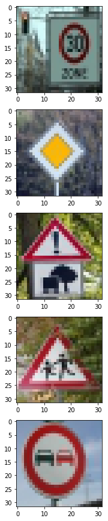
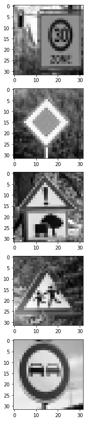
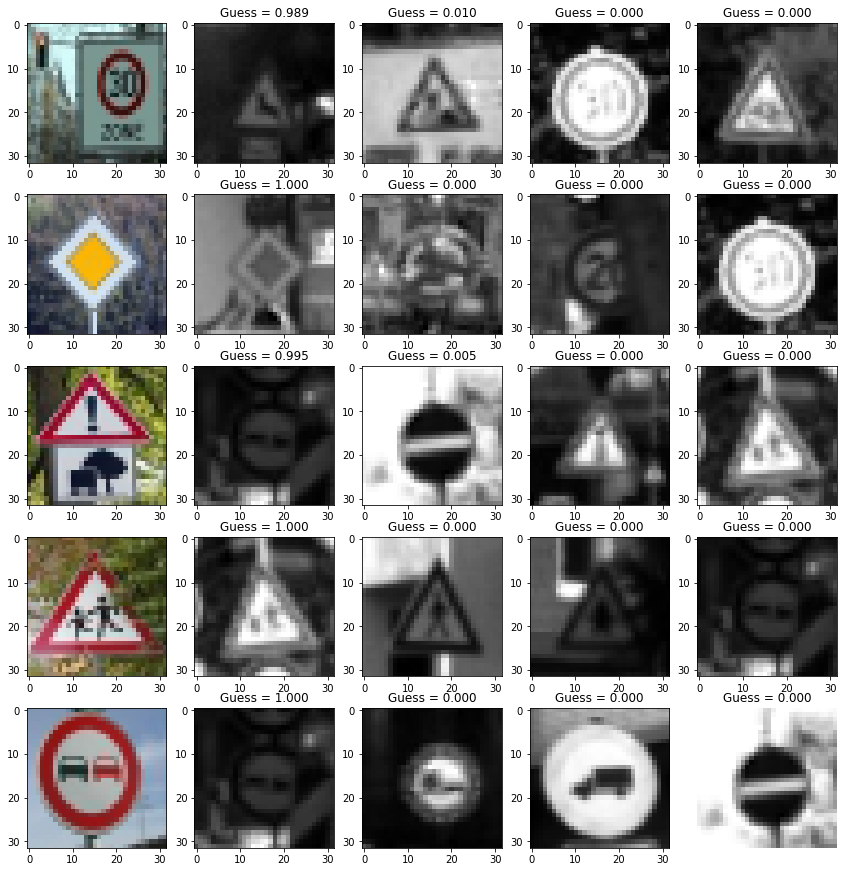

# Traffic Sign Recognition 

## Writeup

### Data Set Summary & Exploration

#### 1. Provide a basic summary of the data set. In the code, the analysis should be done using python, numpy and/or pandas methods rather than hardcoding results manually.


Number of training examples = 34799

Number of validation examples = 4410

Number of testing examples = 12630

Image data shape = (32, 32, 1)

Number of classes = 43


### Design and Test a Model Architecture

#### 1. Describe how you preprocessed the image data. What techniques were chosen and why did you choose these techniques? Consider including images showing the output of each preprocessing technique. Pre-processing refers to techniques such as converting to grayscale, normalization, etc. (OPTIONAL: As described in the "Stand Out Suggestions" part of the rubric, if you generated additional data for training, describe why you decided to generate additional data, how you generated the data, and provide example images of the additional data. Then describe the characteristics of the augmented training set like number of images in the set, number of images for each class, etc.)

First I converted the images to grayscale, because it is more practical while working with video-data and also much faster (i have tought the dnn on CPU only). Reducing the input information by removing the color can be bad for our results, but these signs are designed to be detectable even without seeing colors (darkness, color blindness, reflection).

I then normalized the data which reduces computation time and is also more viable for mathmatical computation (stable).

I then augmented the images by creating a new image for every traffic sign for these applications:

	- reposition the traffic signs inside the image by moving in random directions
- scale (up, down) the image and therefore the sign by random values
- rotate the image (and therefore the sign) in random directions

Now i have 4 times the training set.

```
Number of training examples = 139196
Number of validation examples = 4410
Number of testing examples = 12630
```

### 

| input                  | edited               |
| ---------------------- | -------------------- |
|  |  |


#### 2. Describe what your final model architecture looks like including model type, layers, layer sizes, connectivity, etc.) Consider including a diagram and/or table describing the final model.

My final model consisted of the following layers:

|      Layer      |                Description                 |  Input   |  Output  |
| :-------------: | :----------------------------------------: | :------: | :------: |
| Convolution 5x5 | 1x1 stride, valid padding, RELU activation | 32x32x1  | 28x28x6  |
|   Max pooling   |           2x2 stride, 2x2 window           | 28x28x6  | 14x14x6  |
| Convolution 5x5 | 1x1 stride, valid padding, RELU activation | 14x14x6  | 10x10x16 |
|   Max pooling   |           2x2 stride, 2x2 window           | 10x10x16 |  5x5x16  |
|     Dropout     |               keep_prob 50%                | 10x10x16 |  5x5x16  |
|     Flatten     |        16 dimensions -> 1 dimension        |  5x5x16  |   400    |
| Fully Connected |   connect every neuron,  RELU activation   |   400    |   120    |
| Fully Connected |   connect every neuron,  RELU activation   |   120    |    84    |
| Fully Connected |            connect every Output            |    84    |    43    |

#### 3. Describe how you trained your model. The discussion can include the type of optimizer, the batch size, number of epochs and any hyperparameters such as learning rate.

I trained my neural network on my local laptop CPU, whic is the reason why i was using a low batch-size and a high learning rate.

My final training parameters are:

    epochs = 15
    batch_size = 120
    beta = 0.0001 for regularization (added because of low validation accuracy [overfitting])
    optimizer: AdamOptimizer 
    learning_rate = 0.001
    keep_prob = 0.5 	# only for learning, not for validating

My results vary slightly, my latest attempt was:

    validation accuracy of latest training = 95.6%
    test accuracy of latest training =  94.9%

#### 4. Describe the approach taken for finding a solution and getting the validation set accuracy to be at least 0.93. Include in the discussion the results on the training, validation and test sets and where in the code these were calculated. Your approach may have been an iterative process, in which case, outline the steps you took to get to the final solution and why you chose those steps. Perhaps your solution involved an already well known implementation or architecture. In this case, discuss why you think the architecture is suitable for the current problem.

I started with the predefined LeNet and quickly found some better parameters while searching for LeNet configurations (bigger Kernel· slightly varying convolutional layers and their resp. in/outputs). All these dnns were overfitting my data, so i tried regularization (beta 0.0001) (which was described in some forums and online sources) which helped a little bit. The biggest factor in reducing the overfitting was the included dropout layer after my convolutional layers. After that my net kept a stable ~95%. 

### Test a Model on New Images

#### 1. Choose five German traffic signs found on the web and provide them in the report. For each image, discuss what quality or qualities might be difficult to classify.

Here are five German traffic signs that I found on the web:


Image 1 could make problems for the classifier, because downsizing and regularizing the image corrupted the resolution and therefore the fidelity of the image ... the sign is inside a rectanglular (slightly tilted) traffic sign (which is probably not in that dataset [or not often enough])

Image 3 shows two different signs together, the botom one is not in the dataset but the combination of both should confuse our network.

Image 4 has a clear image, but a tree is in the way and the sign itself has low fidelity (pictogram humas are not clearly visible even for humans)

#### 2. Discuss the model's predictions on these new traffic signs and compare the results to predicting on the test set. At a minimum, discuss what the predictions were, the accuracy on these new predictions, and compare the accuracy to the accuracy on the test set (OPTIONAL: Discuss the results in more detail as described in the "Stand Out Suggestions" part of the rubric).

## Calculate the accuracy for these 5 new images. 
### For example, if the model predicted 1 out of 5 signs correctly, it's 20% accurate on these new images.


    checking image 0 with label 1
    got acc of: 0.0
    checking image 1 with label 12
    got acc of: 1.0
    checking image 2 with label 18
    got acc of: 0.0
    checking image 3 with label 27
    got acc of: 0.0
    checking image 4 with label 9
    got acc of: 1.0
    
    overall accuracy:
    40.0 %


#### 3. Describe how certain the model is when predicting on each of the five new images by looking at the softmax probabilities for each prediction. Provide the top 5 softmax probabilities for each image along with the sign type of each probability. (OPTIONAL: as described in the "Stand Out Suggestions" part of the rubric, visualizations can also be provided such as bar charts)


thanks to: https://github.com/Goddard/udacity-traffic-sign-classifier, because it looks nice ^-^



As predicted earlier, image 1, 3 and 4 make problems. The neural network is confused in these cases and can only predict 40% (2 out of 5) of these traffic signs correctly. It is understandable in all 3 mistaken cases and we would have to improve our training set to deal with these kind of errors.